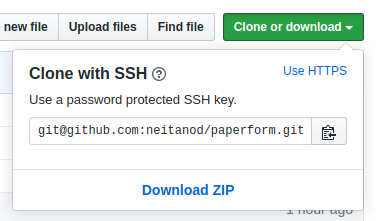

# Proyecto Paperform

[Volver](?)

## Instalando una copia local para programar

Lo primero que se necesita es que nuestra máquina pueda ejecutar Node y NPM.
Para eso ya existen [muchos tutoriales](https://www.google.com/search?q=como+instalar+node+js+en+windows)
asique no lo voy a explicar acá.

También se necesita tener [Git instalado](https://www.google.com/search?q=como+instalar+git+en+windows) y [configurado](https://www.google.com/search?q=como+configurar+git).

Por último, se necesita una cuenta en [GitHub](https://github.com).

Lo primero que hay que hacer es crear un "fork" del repositorio de Paperform.
En otras palabras: crear un repo propio clonando el contenido del repo de 
Paperform.  Haber realizado este "fork" nos va a permitir subir a GitHub los 
cambios que hagamos sin necesidad de que el dueño del repo principal de Paperform
(yo) los apruebe, y de ese modo podemos usar la interfaz web de GitHub para mirar
los cambios y aportes que cada uno desarrolló para Paperform incluso antes de que
el proyecto principal los incorpore.


Ser dueños de este fork hosteado en GitHub también nos facilita la creación de 
"pull requests", es decir, presentar los cambios usando Git para que el repo 
principal los pueda incorporar con un simple click.

Una vez que los comandos `npm` y `git` funcionen, descargar una copia de 
Paperform para trabajar en ella de esta forma:

¡Atención!  En el siguiente comando hay que cambiar "neitanod" por el nombre de
usuario que estemos usando, es decir:  nuestra propia cuenta, el usuario que sea
dueño del fork.

Dicho de otro modo, no es esta la URL exacta que tenemos que clonar, sino la de
nuestro propio fork.  Podemos averiguarla aquí:



```
cd projects   # (cualquier carpeta en la que quieran guardar los proyectos de desarrollo)
git clone git@github.com:neitanod/paperform.git
```

Este último comando automáticamente va a crear una carpeta llamada paperform y
va a colocar en ella los archivos fuente del proyect.

También se puede clonar usando el protocolo HTTPS:

```
cd projects   # (cualquier carpeta en la que quieran guardar los proyectos de desarrollo)
git clone https://github.com/neitanod/paperform.git
```

Existen ventajas por usar el método SSH en vez de HTTPS (no tener que escribir
la contraseña de GitHub cada vez que queremos subir cambios, sobre todo), pero
el método HTTPS no requiere ninguna configuración ni instalación de programas
adicionales, mientras que el protocolo SSH puede requerirlos.
